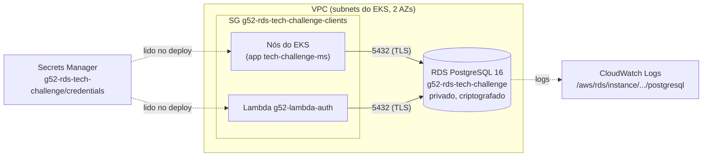

# g52-infra-rds-tech-challenge

Terraform do banco de dados gerenciado do Tech Challenge (Grupo 52): **Amazon RDS for PostgreSQL 16**, usado pela aplicação principal (EKS) e pela Lambda de autenticação por CPF.

## Arquitetura



- O banco não tem acesso público (`publicly_accessible = false`). O SG do RDS só aceita a porta 5432 vinda do SG **clients**.
- O SG **clients** é criado aqui e anexado pelos consumidores: os nós do EKS (repo `g52-infra-eks-tech-challenge`) e a Lambda (repo `g52-lambda-tech-challenge`). Assim, recriar o EKS ou a Lambda não exige mexer nas regras do banco.
- A senha é gerada pelo Terraform (`random_password`) e guardada no Secrets Manager, **sem rotação automática**. A app e a Lambda recebem as credenciais por variável de ambiente no deploy, e uma rotação quebraria a conexão até o próximo deploy.
- O TLS é obrigatório (`rds.force_ssl = 1`). Queries acima de 500 ms vão para o log do Postgres, exportado para o CloudWatch.

## Recursos

| Recurso | Descrição |
|---|---|
| `aws_db_instance.this` | PostgreSQL 16, `db.t4g.micro`, gp3 20 GB (autoscaling até 50 GB), criptografado, backup automático |
| `aws_db_subnet_group.this` | Subnets das 2 AZs (as mesmas do EKS) |
| `aws_security_group.rds` / `aws_security_group.clients` | Acesso ao banco restrito a quem anexar o SG `clients` |
| `aws_db_parameter_group.this` | `rds.force_ssl` e `log_min_duration_statement` |
| `aws_secretsmanager_secret.credentials` | `{engine, host, port, dbname, username, password}` |
| `aws_cloudwatch_log_group.postgresql` | Logs do Postgres com retenção configurável |

### Variáveis (`infra/inventories/dev/terraform.tfvars`)

| Variável | Descrição |
|---|---|
| `db_identifier` | Nome da instância. Também compõe os nomes do secret (`<id>/credentials`) e do SG de clientes (`<id>-clients`), que os outros repositórios usam para encontrar o banco |
| `subnet_ids` | Subnets do subnet group (mínimo de 2 AZs) |
| `engine_version`, `instance_class`, `allocated_storage`, `max_allocated_storage` | Dimensionamento |
| `db_name`, `db_username` | Banco e usuário master |
| `backup_retention_period` | Dias de backup. O padrão é 1, porque contas no free tier não aceitam mais que isso |
| `multi_az` | Standby em outra AZ (desligado no dev por custo) |
| `destroy` | `true` faz o pipeline executar `terraform destroy` |

### Outputs

`address`, `port`, `db_name`, `credentials_secret_arn`, `credentials_secret_name`, `clients_security_group_id` e `clients_security_group_name`.

## Ordem de deploy

O banco é a base dos outros repositórios:

1. **g52-infra-rds-tech-challenge** (este)
2. **g52-infra-eks-tech-challenge**: anexa o SG `clients` aos nós
3. **g52-lambda-tech-challenge**: lê endpoint e credenciais do RDS e anexa o SG `clients`
4. **g52-app-tech-challenge**: o deploy lê o secret e aplica no ConfigMap/Secret. O Flyway cria o schema e o seed no primeiro start

Para destruir, use a ordem inversa: o SG `clients` não pode ser apagado enquanto estiver anexado aos nós do EKS ou à Lambda.

## Execução manual

```bash
cd infra
terraform init -reconfigure \
  -backend-config="bucket=g52-terraform-state-dev-<account-id>" \
  -backend-config="key=dev/g52-rds-tech-challenge/terraform.tfstate" \
  -backend-config="region=us-east-1"

terraform plan  -var-file=inventories/dev/terraform.tfvars
terraform apply -var-file=inventories/dev/terraform.tfvars
```

Para pegar as credenciais:

```bash
aws secretsmanager get-secret-value --secret-id g52-rds-tech-challenge/credentials --query SecretString --output text
```

## Pipeline CI/CD

```
feature/** -> develop -> release/vX.X.X -> main
```

| Workflow | Gatilho | Ação |
|---|---|---|
| `1-feature-to-dev.yml` | Push em `feature/**` | Abre PR automático para `develop` |
| `2-dev-to-release.yml` | Push/PR em `develop` | `terraform plan` (PR) ou `apply/destroy` (push); cria branch e PR `release/vX.X.X` |
| `4-release-to-main.yml` | PR fechado em `release/**` | Abre PR automático da release para `main` |

A autenticação na AWS é via OIDC com o role `github-actions-terraform-dev`. A única configuração do repositório é a variável `AWS_ACCOUNT_ID`.

## Tecnologias

Terraform (AWS provider 6), Amazon RDS for PostgreSQL, Secrets Manager, CloudWatch Logs, GitHub Actions.
