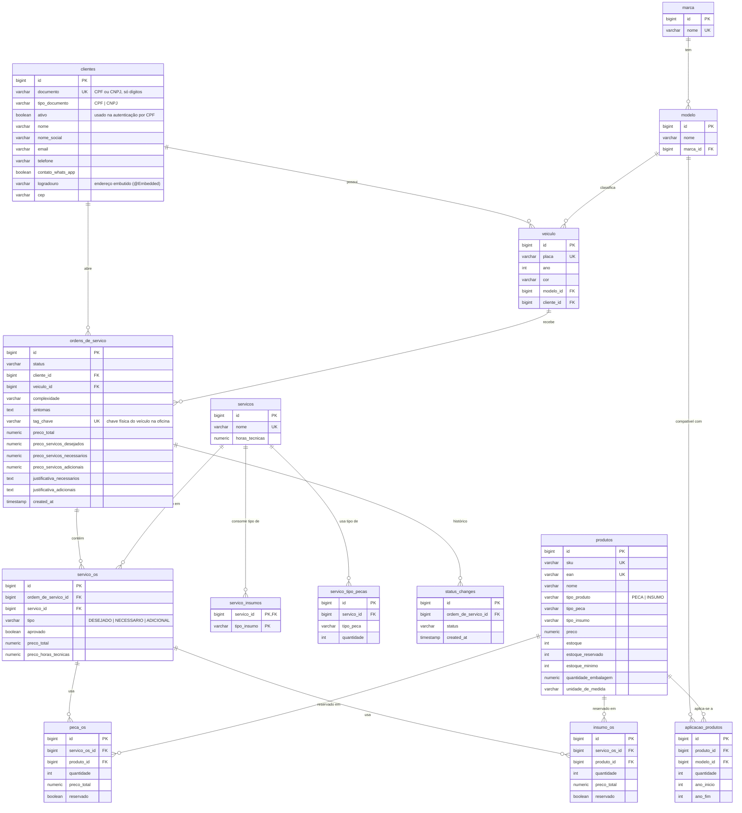

# Modelo de dados

Banco relacional da oficina: clientes, veículos, catálogo (peças, insumos, serviços) e o ciclo de vida das ordens de serviço (OS). O schema é versionado por **Flyway** no repositório da aplicação ([`g52-app-tech-challenge`](https://github.com/Teplotax/g52-app-tech-challenge), `app/src/main/resources/db/migration`), e a infraestrutura do banco fica neste repositório.

| Migration | Conteúdo |
|---|---|
| `V1__create_schema.sql` | Criação das tabelas |
| `V2__seed_data.sql` | Dados de exemplo (marcas, modelos, clientes, veículos, peças, insumos, serviços) |
| `V3__revisao_modelo.sql` | Revisão do modelo para a Fase 3 (ver [Ajustes no modelo](#ajustes-no-modelo-v3)) |

## Escolha do banco de dados

### Por que relacional

O domínio é transacional e fortemente relacionado:

- **Consistência de estoque.** Ao adicionar serviços a uma OS, o sistema reserva peças e insumos (`estoque_reservado`). Ao finalizar, ele consome o estoque real e libera a reserva. Essas operações alteram várias linhas (OS, itens da OS, produtos) e precisam ser atômicas: uma falha no meio não pode deixar a reserva feita e a OS sem o serviço. Transações ACID resolvem isso sem lógica de compensação.
- **Integridade referencial.** Uma OS sempre aponta para um cliente e um veículo existentes. Um item de OS aponta para um serviço e um produto existentes. Chaves estrangeiras garantem isso no próprio banco, independente da aplicação.
- **Consultas com junções e agregações.** A listagem de OS filtra por placa, documento do cliente, status e período. Os dashboards de monitoramento pedem volume diário de OS e tempo médio por status. São consultas naturais em SQL (JOIN, GROUP BY, funções de janela) e ruins de modelar em um banco chave-valor.
- **Modelo estável e conhecido.** As entidades e relações estão bem definidas desde a Fase 1. Não há necessidade de schema flexível.

### Por que PostgreSQL

| Critério | PostgreSQL | MySQL | SQL Server |
|---|---|---|---|
| Licença / custo | Open source, sem licença | Open source | Licença paga (no RDS, cobrada por hora) |
| Constraints (`CHECK`, FKs, índices parciais) | Completo | `CHECK` só a partir da 8.0.16, sem índice parcial | Completo |
| Funções de janela (tempo médio por status) | Sim | Sim (8.0+) | Sim |
| Paridade com o ambiente local | Mesma imagem `postgres:16` no `docker-compose` | — | Imagem pesada, licença de dev |
| Suporte no stack (Hibernate, Flyway, driver JDBC) | Nativo | Nativo | Nativo |

O projeto já usava PostgreSQL desde a Fase 2 (container no `docker-compose` e pod no Kubernetes). Manter o mesmo motor evita reescrever migrations e deixa o ambiente local idêntico ao da nuvem.

### Por que Amazon RDS (gerenciado)

Na Fase 2, o Postgres rodava como pod no EKS, com volume EBS. Isso trazia problemas: o backup era manual, o volume ficava órfão quando o cluster era destruído, o banco não tinha patch nem failover, e ele disputava CPU e memória com a aplicação nos nós `t3.small`.

| Alternativa | Por que não |
|---|---|
| Postgres no Kubernetes (Fase 2) | Sem backup automático nem failover, ciclo de vida preso ao do cluster, ocupa recursos dos nós |
| Amazon Aurora PostgreSQL | Mais caro (instância mínima maior, cobrança de I/O). As vantagens dele (réplicas de leitura rápidas, storage distribuído) não se pagam no volume da oficina |
| Aurora Serverless v2 | Capacidade mínima cobrada continuamente, mais caro que uma `db.t4g.micro` em ambiente de estudo |
| DynamoDB | Não relacional. Transações entre várias entidades e as consultas de relatório ficariam complexas, e exigiria reescrever toda a camada de persistência |

O **RDS for PostgreSQL** entrega backup automático com point-in-time recovery, patches de versão menor, criptografia em repouso, TLS obrigatório, logs no CloudWatch, opção de Multi-AZ quando for necessário (variável `multi_az`) e autoscaling de storage. Tudo isso provisionado por Terraform e com custo de free tier em dev (`db.t4g.micro`, 20 GB gp3).

## Diagrama ER



## Relacionamentos

**Cadastro**

- **clientes → veiculo (1:N).** Um cliente pode ter vários veículos, e cada veículo pertence a um cliente. O endereço do cliente é um objeto de valor (`@Embedded`), guardado em colunas da própria tabela `clientes`, porque não tem identidade nem é compartilhado.
- **marca → modelo (1:N)** e **modelo → veiculo (1:N).** Marca e modelo são tabelas de referência (seed) para padronizar os veículos e permitir a compatibilidade de peças.

**Catálogo**

- **produtos.** Peças e insumos ficam na mesma tabela (herança *single table*), diferenciados por `tipo_produto`. Os dois compartilham SKU, EAN, preço e o controle de estoque em duas camadas: `estoque` (real) e `estoque_reservado` (comprometido com OS em andamento).
- **produtos ↔ modelo (N:N via `aplicacao_produtos`).** Indica em quais modelos e em que faixa de anos (`ano_inicio`..`ano_fim`) uma peça é aplicável, e em que quantidade. É uma associativa com atributos próprios, por isso tem `id` e não usa chave composta.
- **servicos → servico_insumos / servico_tipo_pecas (1:N).** É a "receita" do serviço: quais *tipos* de insumo e de peça ele consome. Ela é genérica, e a peça concreta só é escolhida na OS, conforme o modelo do veículo.

**Ordem de serviço**

- **clientes → ordens_de_servico** e **veiculo → ordens_de_servico (1:N).** Toda OS é aberta para um cliente e um veículo (FKs `NOT NULL`).
- **ordens_de_servico → status_changes (1:N).** É o histórico append-only das transições de status. Cada mudança grava uma linha com `created_at`, o que permite calcular o tempo gasto em cada etapa (diagnóstico, execução, finalização) sem perder o histórico ao atualizar `ordens_de_servico.status`.
- **ordens_de_servico → servico_os (1:N)** e **servicos → servico_os (1:N).** Esta é a instância de um serviço do catálogo dentro de uma OS. O `tipo` indica a origem do serviço: desejado pelo cliente, necessário segundo o diagnóstico, ou adicional. O `aprovado` guarda a decisão do cliente no orçamento. Os preços são copiados no momento do orçamento (snapshot), para que uma mudança de preço no catálogo não altere OS já orçadas.
- **servico_os → peca_os / insumo_os (1:N)** e **produtos → peca_os / insumo_os (1:N).** São os produtos concretos usados em cada serviço da OS. O `reservado` indica se o item já está abatido em `produtos.estoque_reservado`. Quando falta estoque na aprovação, o item fica não reservado e a OS vai para `AGUARDANDO_AQUISICAO`.

## Ajustes no modelo (V3)

| Ajuste | Motivo |
|---|---|
| `clientes.ativo BOOLEAN NOT NULL DEFAULT TRUE` | A Lambda de autenticação precisa consultar o **status** do cliente, e cliente inativo recebe 403. O default mantém os clientes existentes ativos e não exige mudança na aplicação |
| `clientes.tipo_documento NOT NULL` + `CHECK (CPF, CNPJ)` | A autenticação por CPF depende desse campo. A API já validava, agora o banco também garante |
| Remoção de `idx_documento`, `idx_placa`, `idx_produto_sku`, `idx_produto_ean`, `idx_os_tag_chave` | Essas colunas já são `UNIQUE`, e o PostgreSQL cria um índice para cada constraint `UNIQUE`. Os índices extras duplicavam o custo de escrita e de espaço sem nenhum ganho de leitura |
| Índices nas FKs `modelo.marca_id`, `servico_tipo_pecas.servico_id`, `servico_os.*`, `peca_os.*`, `insumo_os.*` | O PostgreSQL **não** indexa FKs automaticamente. Sem índice, carregar os itens de uma OS faz *seq scan*, e apagar ou atualizar a linha pai varre a tabela filha inteira |
| `idx_status_changes_os_created_at (ordem_de_servico_id, created_at)` | Leitura do histórico de uma OS em ordem cronológica e cálculo do tempo médio por status (dashboard da Fase 3) |
| `idx_os_created_at` | Filtro por período na listagem de OS (`dataInicio`/`dataFim`) e volume diário de OS (dashboard) |
| `CHECK` de estoque, quantidades, preços e faixa de anos | O domínio já impede estoque negativo e quantidades inválidas. O banco passa a garantir isso também contra bugs, scripts manuais ou outros consumidores (como a Lambda) |

O schema continua com o Flyway como dono exclusivo (`ddl-auto: none`). As anotações `@Index` das entidades JPA só valem para o H2 dos testes automatizados.

## Consultas que o modelo atende

Volume diário de OS (usa `idx_os_created_at`):

```sql
SELECT date_trunc('day', created_at) AS dia, count(*) AS total
  FROM ordens_de_servico
 WHERE created_at >= now() - interval '30 days'
 GROUP BY 1
 ORDER BY 1;
```

Tempo médio em cada status (usa `idx_status_changes_os_created_at`):

```sql
SELECT status, avg(saida - entrada) AS tempo_medio
  FROM (
        SELECT status,
               created_at AS entrada,
               lead(created_at) OVER (PARTITION BY ordem_de_servico_id ORDER BY created_at) AS saida
          FROM status_changes
       ) t
 WHERE saida IS NOT NULL
 GROUP BY status;
```
